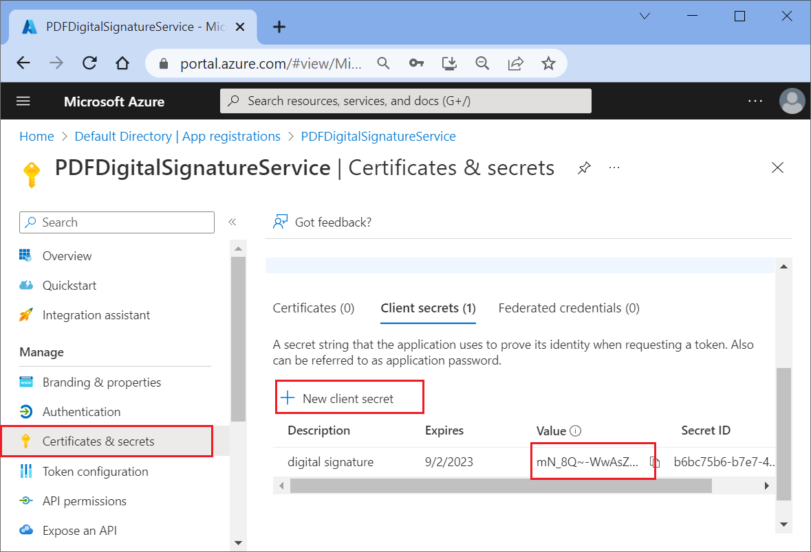
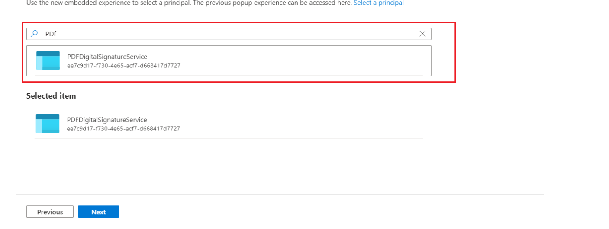

# Create your own PDF digital signature web service using Azure key vault and Syncfusion C# PDF library

The [Syncfusion .NET PDF library](https://www.syncfusion.com/document-processing/pdf-framework/net) is a .NET library used to create your own PDF digital signature using Azure key vault. This repository contains example to sign a PDF documnet using Azure key vault. 

Sample name | Description 
--- | ---
[Digital signature Blazor client application](https://github.com/SyncfusionExamples/sign-pdf-using-azure-key-vault/tree/master/blazor_client) | A Blazor WebAssembly (WASM) application using .NET 7.0 can be utilized to make a request to a server-side Web API application. 
[Digital signature Web API](https://github.com/SyncfusionExamples/sign-pdf-using-azure-key-vault/tree/master/digital_signature_web_API) | Web API service to sign the PDF document.  

#### Azure key vault 
Azure Key Vault is a cloud-based key management service that allows you to create, store, and manage cryptographic keys and certificates. Syncfusion PDF Library is a .NET library enabling you to programmatically create and manipulate PDF documents. By combining these two powerful tools, we can create a robust and secure PDF digital signature service. 

### 1. Steps to create Azure key vault and certificate 

Step 1: First, we need to create an Azure key vault resource in your azure portal, please refer the below link to create the same. 
https://learn.microsoft.com/en-us/azure/key-vault/general/quick-create-portal 

Step 2: Once the resource is created, go to the key vault and choose the "Certificates" option and click the "Generate/Import" button.


Step 3: Choose the option Generate in the "Method of Certificate Creation" field, this option generates the new certificate. Also, in this example we have chosen a Self-signed certificate. 


N> You can also import your own certificate from your local device by selecting the Import option.  


Step 4: Next select Advanced Policy Configuration, here we can customize the private key export option, choose No in the option. 


Step 5: Finally, click Create button, now the key vault certificate is created under your account. 


You can click and open the properties of the certificate as follows. 


### 2. Register the app to access the Azure key vault 

To be able to access the Azure key vault from the web API, we must register it in the Azure Active Directory. To do so, please follow the steps outlined below. 

Step 1: Open Azure active directory in that select App registration and click New registration. 


Step 2: Name your app name and proceed to register.


Once registered you will get the following information copy the client ID and tenant ID to use in the Web API.


Step 3: Now select API permissions from the side menu and click the button Add a permission, select the azure key vault and choose full access and complete this process by clicking Add permissions. 


Step 4: Select the Certificate & secrets and click New client secret to create new secret key and copy this key to access this from Web API. 


### 3. Add the access policy to azure key vault 
In the previous section we created and registered the application, now we need to provide access to this newly created application to access the Azure key vault. 

Step 1: Go to azure key vault and select Access policies and click Create button. 


Step 2: Select necessary permissions and click next. 


Step 3: in this window select the application we created in the previous section called PDFDigitalSignatureService and finally click **Create** button. 



Now the application listed in the Access policies section. 


### 4. Create a PDF digital signature Web API service

Now we can create a web API to digitally sign the PDF document, to do this create ASP.NET core minimal web API refer the below link. 

[Steps to create minimal API project with ASP.NET Core 7.0](https://www.syncfusion.com/forums?view=aspnetcore-7.0&tabs=visual-studio)   

Once project created install the following NuGet packages as reference from the NuGet.org. 

* [Azure.Security.KeyVault.Secrets](https://www.nuget.org/packages/Azure.Security.KeyVault.Secrets)
* [Azure.Identity](https://www.nuget.org/packages/Azure.Identity/1.9.0-beta.2) 
* [Azure.Security.KeyVault.Keys](https://www.nuget.org/packages/Azure.Security.KeyVault.Keys) 
* [Azure.Security.KeyVault.Certificates](https://www.nuget.org/packages/Azure.Security.KeyVault.Certificates)
* [Syncfusion.Pdf.Net.Core](https://www.nuget.org/packages/Syncfusion.Pdf.Net.Core) 

The following complete code is used to sign the PDF document with the help of external signing which is implemented in [Program.cs](https://github.com/SyncfusionExamples/sign-pdf-using-azure-key-vault/blob/master/digital_signature_web_API/Program.cs) file.  

```csharp

app.MapPost("api/signPDF", async (HttpContext context) => 
{ 
    var request = await context.Request.ReadFormAsync(); 
    if (request.Files.Count>0) 
    { 
        var pdfFile = request.Files[0].OpenReadStream(); 

        //Provide your azure key vault details here 
        String tenantId = "tenantID"; 
        String clientId = "clientID"; 
        String secret = "secret"; 
        String vaultUri = "https://signature.vault.azure.net/"; 
        ClientSecretCredential credential = new ClientSecretCredential(tenantId, clientId, secret); 
        //Get the public certificate to sign the PDF document 
        X509Certificate2 pubCertifciate = GetPublicCertificate(credential, vaultUri); 
        //Build the certificate chain. 
        X509Chain chain = new X509Chain(); 
        chain.Build(pubCertifciate); 
        List<X509Certificate2> certificates = new List<X509Certificate2>(); 
        for (int i = 0; i < chain.ChainElements.Count; i++) 
        { 
            certificates.Add(chain.ChainElements[i].Certificate); 
        } 
        //Load the PDF document 
        PdfLoadedDocument loadedDocument = new PdfLoadedDocument(pdfFile); 

        //Load the existing page. 
        PdfLoadedPage? page = loadedDocument.Pages[0] as PdfLoadedPage; 

        //Create a new PDF signature object. 
        PdfSignature signature = new PdfSignature(loadedDocument, page!, null, "Sig1"); 
        signature.Bounds = new Syncfusion.Drawing.RectangleF(0, 0, 200, 100); 

        //Create CryptographyClient with key identifier 
        CryptographyClient client = new CryptographyClient(new Uri("https://signature.vault.azure.net/keys/PDFSigner/adb90908592644f69e0e61bcf7c69ff4"), credential); 

        //Sing using external signer. 
        signature.AddExternalSigner(new ExternalSigner(client), certificates, null); 
        signature.Settings.DigestAlgorithm = DigestAlgorithm.SHA256; 
        MemoryStream ms = new MemoryStream(); 
        //Save and close the document. 
        loadedDocument.Save(ms); 
        ms.Position = 0; 
        loadedDocument.Close(true); 
        context.Response.ContentType = "application/pdf"; 
        await context.Response.Body.WriteAsync(ms.ToArray()); 
    } 
}); 

```

The external singer interface should be integrated in order to utilize the azure key to externally sign the hash of the PDF document. The interface is designed to allow the retrieval of the hash of the PDF document which has been processed through public certificates, and subsequently enable the signing of the document using the azure key. 

```csharp

//External signer to sign the PDF document using Azure Key Vault. 

internal class ExternalSigner : IPdfExternalSigner 
{ 
    public string HashAlgorithm => "SHA256"; 
    private CryptographyClient keyClient;  

    public ExternalSigner(CryptographyClient client) 
    { 
        keyClient = client; 
    } 
    public byte[] Sign(byte[] message, out byte[] timeStampResponse) 
    { 
        var digest = SHA256.Create().ComputeHash(message); 
        timeStampResponse = null; 
        //Sign the hash of the PDF document 
        return keyClient 
            .SignAsync( 
                SignatureAlgorithm.RS256, 
                digest) 
            .Result.Signature; 
    } 
} 

```

Now the Web service has been created; it is now possible to utilize this service in any application. For the purposes of this blog, a Blazor WebAssembly (WASM) application will be developed to showcase the capabilities of the Web API service. 

### 5. Create Blazor WASM with .NET 7  

The client application in this implementation is a Blazor WASM application built with .NET version 7.0. To create a new ASP.NET Core Blazor WebAssembly application using Visual Studio 2022, please follow the guidance provided in this link. Within the application, we utilize the HttpClient.PostAsync method to send a POST request to the specified URI as an asynchronous operation. You can find the implementation in [Index.razor](https://github.com/SyncfusionExamples/sign-pdf-using-azure-key-vault/blob/master/blazor_client/Pages/Index.razor).  

```csharp

@code { 

    private async Task SignPDF() 
    {        
        //Create http client to send both files and json data 
        using (var client = new HttpClient()) 
        { 
            //Create multipart form data content 
            using (var content = new MultipartFormDataContent()) 
            { 
                var document = await Http.GetByteArrayAsync("PDF_Succinctly.pdf"); 
                content.Add(CreateContent("document", "input.pdf", document));                 
                //Calling web API to sign the PDF document 
                var response = await client.PostAsync("https://localhost:7171/api/signPDF", content);   
                if (response.StatusCode == HttpStatusCode.OK) 
                {    
                    //Downloading the PDF document 
                    var responseContent = await response.Content.ReadAsStreamAsync(); 
                    using var Content = new DotNetStreamReference(stream: responseContent); 
                    await JS.InvokeVoidAsync("SubmitHTML", "HTMLToPDF.pdf", Content); 
                } 
            } 
        } 
    } 
    private ByteArrayContent CreateContent(string name, string fileName, byte[] fileBytes) 
    { 
        var fileContent = new ByteArrayContent(fileBytes); 
        fileContent.Headers.ContentType = new MediaTypeHeaderValue("application/octet-stream"); 
        fileContent.Headers.ContentDisposition = new ContentDispositionHeaderValue("form-data") 
            { 
                Name = name, 
                FileName = fileName 
            }; 
        return fileContent; 
    } 
} 

```
Once the requested response status code is OK, then invoke the JavaScript (JS) function in [index.html](https://github.com/SyncfusionExamples/sign-pdf-using-azure-key-vault/blob/master/blazor_client/wwwroot/index.html) file to save the PDF document.   

```csharp

<script> 
    window.SubmitHTML = async (fileName, contentStreamReference) => { 
        const arrayBuffer = await contentStreamReference.arrayBuffer(); 
        const blob = new Blob([arrayBuffer]); 
        const url = URL.createObjectURL(blob); 
        const anchorElement = document.createElement('a'); 
        anchorElement.href = url; 
        anchorElement.download = fileName ?? ''; 
        anchorElement.click(); 
        anchorElement.remove(); 
        URL.revokeObjectURL(url); 
    } 
</script> 

```

### 6. Launching the Server and Invoking the PDF digital signature service API from the Client

Here are the steps to launching the server and invoking the digital signature API from the client application.  

Step 1: Run the Web API application, which will launch the published web API in the browser.   

Step 2: To sign a PDF document using the client application, send an asynchronous POST request to the specified URI (e.g., https://localhost:7171/api/signPDF) on the localhost. This will send the request to the server application, which will sign the PDF document using azure key vault and send the response back to the client.  

Upon successful PDF signing, you will receive a PDF document as illustrated in the following screenshot. 


# Resources
*   **Product page:** [Syncfusion PDF Framework](https://www.syncfusion.com/document-processing/pdf-framework/net)
*   **Documentation page:** [Syncfusion .NET PDF library](https://help.syncfusion.com/file-formats/pdf/overview)
*   **Online demo:** [Syncfusion .NET PDF library - Online demos](https://ej2.syncfusion.com/aspnetcore/PDF/CompressExistingPDF#/bootstrap5)
*   **Blog:** [Syncfusion .NET PDF library - Blog](https://www.syncfusion.com/blogs/category/pdf)
*   **Knowledge Base:** [Syncfusion .NET PDF library - Knowledge Base](https://www.syncfusion.com/kb/windowsforms/pdf)
*   **EBooks:** [Syncfusion .NET PDF library - EBooks](https://www.syncfusion.com/succinctly-free-ebooks)
*   **FAQ:** [Syncfusion .NET PDF library - FAQ](https://www.syncfusion.com/faq/)

# Support and feedback
*   For any other queries, reach our [Syncfusion support team](https://www.syncfusion.com/support/directtrac/incidents/newincident?utm_source=github&utm_medium=listing&utm_campaign=github-docio-examples) or post the queries through the [community forums](https://www.syncfusion.com/forums?utm_source=github&utm_medium=listing&utm_campaign=github-docio-examples).
*   Request new feature through [Syncfusion feedback portal](https://www.syncfusion.com/feedback?utm_source=github&utm_medium=listing&utm_campaign=github-docio-examples).

# License
This is a commercial product and requires a paid license for possession or use. Syncfusion’s licensed software, including this component, is subject to the terms and conditions of [Syncfusion's EULA](https://www.syncfusion.com/eula/es/?utm_source=github&utm_medium=listing&utm_campaign=github-docio-examples). You can purchase a licnense [here](https://www.syncfusion.com/sales/products?utm_source=github&utm_medium=listing&utm_campaign=github-docio-examples) or start a free 30-day trial [here](https://www.syncfusion.com/account/manage-trials/start-trials?utm_source=github&utm_medium=listing&utm_campaign=github-docio-examples).

# About Syncfusion
Founded in 2001 and headquartered in Research Triangle Park, N.C., Syncfusion has more than 29,000 customers and more than 1 million users, including large financial institutions, Fortune 500 companies, and global IT consultancies.

Today, we provide 1800+ components and frameworks for web ([Blazor](https://www.syncfusion.com/blazor-components?utm_source=github&utm_medium=listing&utm_campaign=github-docio-examples), [ASP.NET Core](https://www.syncfusion.com/aspnet-core-ui-controls?utm_source=github&utm_medium=listing&utm_campaign=github-docio-examples), [ASP.NET MVC](https://www.syncfusion.com/aspnet-mvc-ui-controls?utm_source=github&utm_medium=listing&utm_campaign=github-docio-examples), [ASP.NET WebForms](https://www.syncfusion.com/jquery/aspnet-webforms-ui-controls?utm_source=github&utm_medium=listing&utm_campaign=github-docio-examples), [JavaScript](https://www.syncfusion.com/javascript-ui-controls?utm_source=github&utm_medium=listing&utm_campaign=github-docio-examples), [Angular](https://www.syncfusion.com/angular-components?utm_source=github&utm_medium=listing&utm_campaign=github-docio-examples), [React](https://www.syncfusion.com/react-components?utm_source=github&utm_medium=listing&utm_campaign=github-docio-examples), [Vue](https://www.syncfusion.com/vue-components?utm_source=github&utm_medium=listing&utm_campaign=github-docio-examples), and [Flutter](https://www.syncfusion.com/flutter-widgets?utm_source=github&utm_medium=listing&utm_campaign=github-docio-examples)), mobile ([Xamarin](https://www.syncfusion.com/xamarin-ui-controls?utm_source=github&utm_medium=listing&utm_campaign=github-docio-examples), [Flutter](https://www.syncfusion.com/flutter-widgets?utm_source=github&utm_medium=listing&utm_campaign=github-docio-examples), [UWP](https://www.syncfusion.com/uwp-ui-controls?utm_source=github&utm_medium=listing&utm_campaign=github-docio-examples), and [JavaScript](https://www.syncfusion.com/javascript-ui-controls?utm_source=github&utm_medium=listing&utm_campaign=github-docio-examples)), and desktop development ([WinForms](https://www.syncfusion.com/winforms-ui-controls?utm_source=github&utm_medium=listing&utm_campaign=github-docio-examples), [WPF](https://www.syncfusion.com/wpf-controls?utm_source=github&utm_medium=listing&utm_campaign=github-docio-examples), [WinUI(Preview)](https://www.syncfusion.com/winui-controls?utm_source=github&utm_medium=listing&utm_campaign=github-docio-examples), [Flutter](https://www.syncfusion.com/flutter-widgets?utm_source=github&utm_medium=listing&utm_campaign=github-docio-examples) and [UWP](https://www.syncfusion.com/uwp-ui-controls?utm_source=github&utm_medium=listing&utm_campaign=github-docio-examples)). We provide ready-to-deploy enterprise software for dashboards, reports, data integration, and big data processing. Many customers have saved millions in licensing fees by deploying our software.


